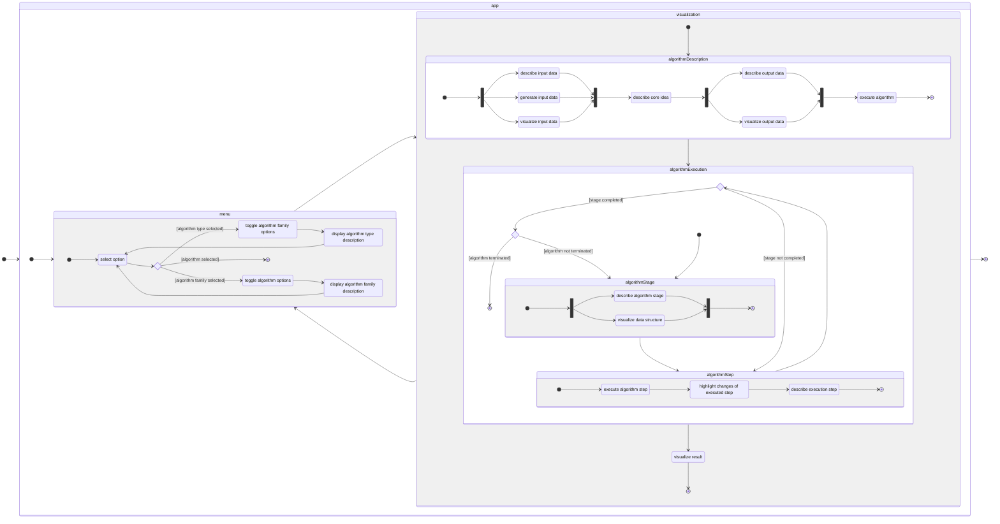
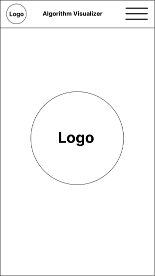
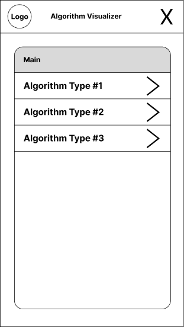
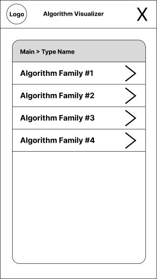
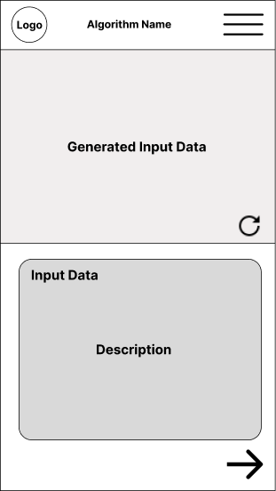
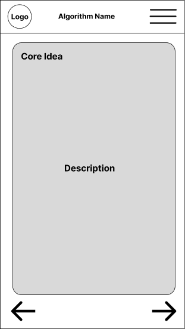
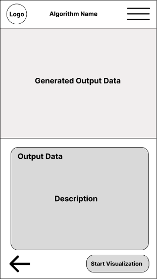
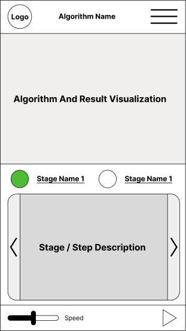

# **Implementation Algorithm Visualizer**
 
 

## **Table Of Contents**
 

- [**Implementation Algorithm Visualizer**](#implementation-algorithm-visualizer)
  - [**Table Of Contents**](#table-of-contents)
  - [**Requirements**](#requirements)
  - [**Application Flow**](#application-flow)
  - [**Wireframes**](#wireframes)
    - [**Mobile**](#mobile)
      - [**Landing Page**](#landing-page)
      - [**Menu**](#menu)
      - [**Algorithm Description**](#algorithm-description)
      - [**Algorithm Execution**](#algorithm-execution)

 
 
 

## **Requirements**

* [Requirements Algorithm Visualizer](./requirements.md)

 
 
 

## **Application Flow**
 

 
 
 

## **Wireframes**
 
 

### **Mobile**
 
 

#### **Landing Page**

 
 

#### **Menu**

 
 

#### **Algorithm Description**

 
 

#### **Algorithm Execution**

